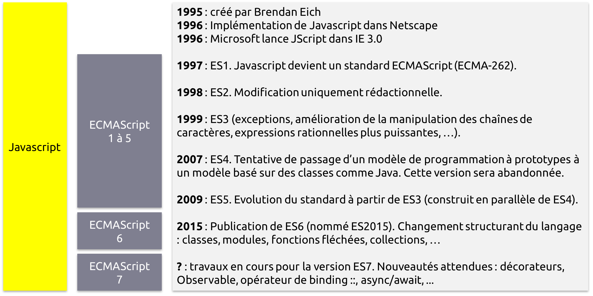

# Langage JavaScript

# JavaScript (version ES5)

JavaScript est un langage de programmation de type script, orienté objet à prototype :
* Variables.
* Fonctions.
* Structures de contrôles.
* Exceptions.
* Bibliothèque d'objets et fonctions de base.

## Origines

