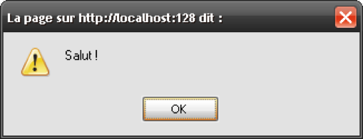
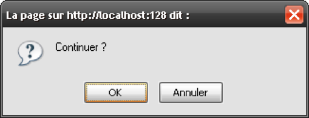
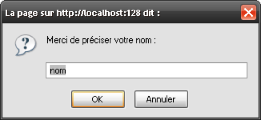

# Boites de dialogue

3 types de boîte de dialogue.

* Afficher un message

```js
alert('Salut !');
```


* Demander une confirmation

```js
var result = confirm('Continuer ?');

// result vaut true ou false suivant le choix utilisateur
```



* Attendre la saisie d'un texte :

```js
var saisie = prompt('Merci de préciser votre nom :');

// saisie contient la saisie utilisateur
``` 




