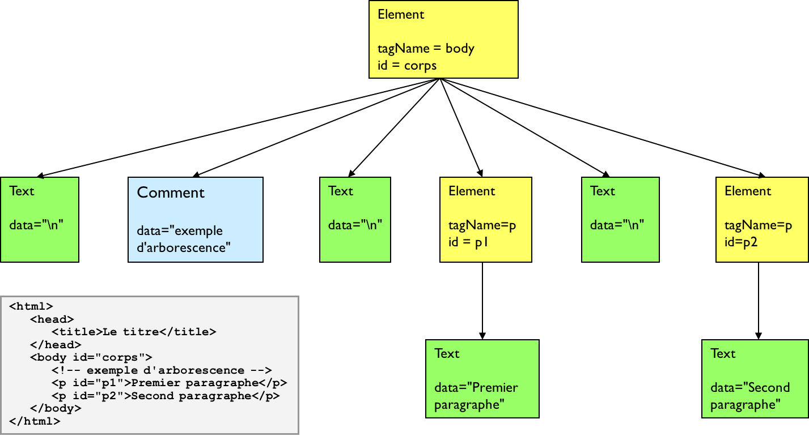

# DOM

DOM : Document Object Model.

Le DOM est une API pour manipuler les documents HTML et XML :
* définit la structure du document sous forme d'une hiérarchie d'objets.

* définit des objets et types d'objets spécifiques.

* définit la manière dont on accède aux éléments du document et comment on peut agir dynamiquement sur eux.

Le W3C propose une normalisation du DOM.

Le DOM est une arborescence d'objets (nœuds) :
* Eléments
* Commentaires
* Textes

Node est le type commun de tous les objets.

Chaque type dispose d'interfaces dédiées.

L'arborescence DOM est plus verbeuse que le balisage HTML : source d'erreurs !

